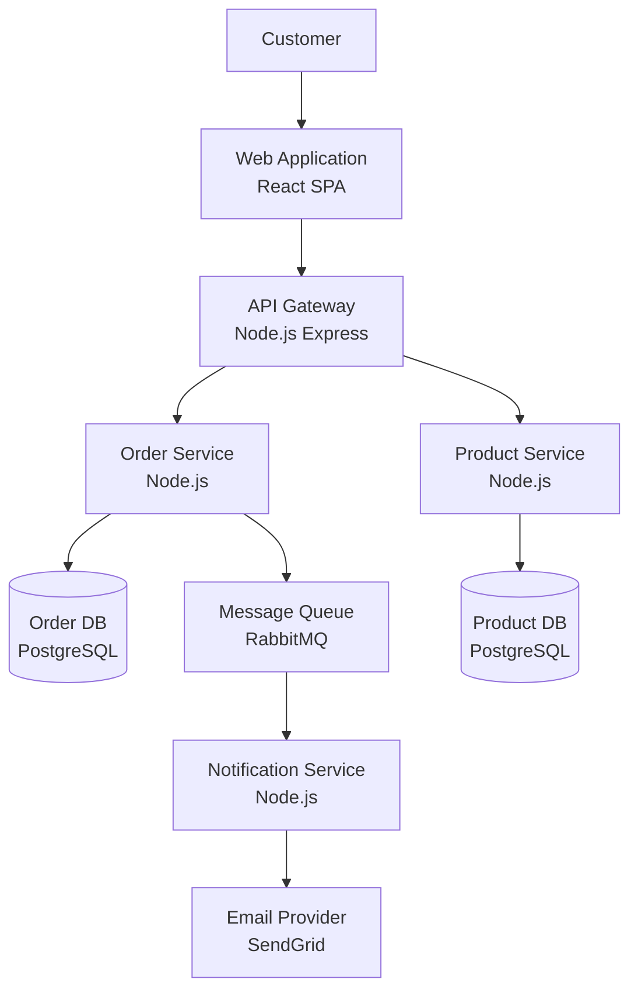
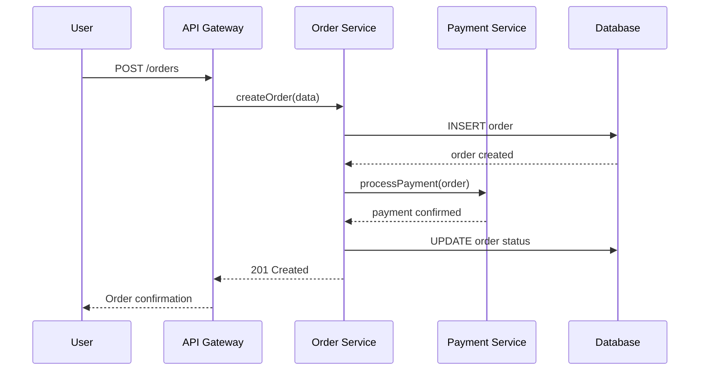

# Architecture Documentation

## Overview

Architecture documentation communicates the structure, decisions, and rationale of a system to diverse audiences. Effective documentation is multi-level (strategic to tactical), decision-aware, and maintained as code alongside the system it describes.

## C4 Model

The C4 model provides four levels of abstraction for visualizing software architecture, from highest-level context down to code.

### Level 1: System Context Diagram

Shows the system as a black box and its relationships with users and external systems. Audience: everyone (business, development, operations).

```
┌──────────┐         ┌─────────────────┐         ┌──────────┐
│ Customer │────────→│  E-Commerce     │────────→│ Payment  │
│ [Person] │  Browse,│  Platform       │ Process │ Gateway  │
│          │  Order  │  [Software      │ payments│ [External│
└──────────┘         │   System]       │         │  System] │
                     └────────┬────────┘         └──────────┘
                              │
                     ┌────────┴────────┐
        ┌────────────┤                 ├────────────┐
        │ Send order │                 │ Get product│
        │ updates    │                 │ data       │
        ▼            │                 │            ▼
┌──────────┐         │                 │    ┌──────────┐
│ Email    │         │                 │    │ Supplier │
│ Service  │         │                 │    │ API      │
│ [External│         │                 │    │ [External│
│  System] │         │                 │    │  System] │
└──────────┘         │                 │    └──────────┘
                     │   Admin User    │
                     │   [Person]      │
                     │   Manages       │
                     │   products,     │
                     │   orders        │
                     └─────────────────┘
```

**Rules**:
- Show the system as ONE box
- Show all users (human and system)
- Show all external dependencies
- Label relationships with what flows between them

### Level 2: Container Diagram

Zooms into the system to show containers (applications, databases, message queues). Audience: developers and operations.

```
┌─ E-Commerce Platform ────────────────────────────────────┐
│                                                           │
│  ┌──────────┐    ┌──────────────┐    ┌───────────────┐   │
│  │ Web App  │───→│ API Gateway  │───→│ Order Service │   │
│  │ [React   │    │ [Node.js     │    │ [Node.js      │   │
│  │  SPA]    │    │  Express]    │    │  Express]     │   │
│  └──────────┘    └──────┬───────┘    └───────┬───────┘   │
│                         │                     │           │
│                         │              ┌──────┴───────┐   │
│  ┌──────────┐    ┌──────┴───────┐     │ Order DB     │   │
│  │ CDN      │    │ Product      │     │ [PostgreSQL] │   │
│  │ [AWS     │    │ Service      │     └──────────────┘   │
│  │  CloudFnt│    │ [Node.js     │                        │
│  └──────────┘    │  Express]    │     ┌──────────────┐   │
│                  └──────┬───────┘     │ Message Queue│   │
│                         │             │ [RabbitMQ]   │   │
│                  ┌──────┴───────┐     └──────────────┘   │
│                  │ Product DB   │                        │
│                  │ [PostgreSQL] │     ┌──────────────┐   │
│                  └──────────────┘     │ Cache        │   │
│                                      │ [Redis]      │   │
│                                      └──────────────┘   │
└───────────────────────────────────────────────────────────┘
```

**Container types**: Web apps, APIs, databases, message queues, file systems, serverless functions.

### Level 3: Component Diagram

Zooms into a single container to show its internal components. Audience: developers working on this container.

```
┌─ Order Service ──────────────────────────────────────────┐
│                                                           │
│  ┌─────────────────┐     ┌──────────────────┐            │
│  │ Order Controller│────→│ Order Service    │            │
│  │ [REST API       │     │ [Business Logic] │            │
│  │  endpoints]     │     └────────┬─────────┘            │
│  └─────────────────┘              │                      │
│                          ┌────────┼────────┐             │
│                          ▼        ▼        ▼             │
│  ┌─────────────┐  ┌──────────┐ ┌───────┐ ┌──────────┐  │
│  │ Auth        │  │ Order    │ │Payment│ │Notification│  │
│  │ Middleware  │  │ Repository│ │Client │ │Publisher  │  │
│  │ [JWT valid] │  │ [DB      │ │[HTTP  │ │[RabbitMQ  │  │
│  └─────────────┘  │  access] │ │client]│ │ producer] │  │
│                   └──────────┘ └───────┘ └──────────┘   │
└───────────────────────────────────────────────────────────┘
```

### Level 4: Code Diagram (Optional)

UML class diagrams or similar for critical parts of the codebase. Only create these for complex or critical code sections -- they become stale quickly.

```
┌─────────────────────────┐
│       OrderService      │
├─────────────────────────┤
│ -orderRepo: OrderRepo   │
│ -paymentClient: PayClient│
│ -eventPublisher: EventPub│
├─────────────────────────┤
│ +createOrder(input)     │
│ +cancelOrder(id)        │
│ +getOrder(id)           │
│ -validateOrder(input)   │
│ -calculateTotal(items)  │
└─────────────────────────┘
         │ uses
         ▼
┌─────────────────────────┐
│    OrderRepository      │
├─────────────────────────┤
│ +save(order)            │
│ +findById(id)           │
│ +findByCustomer(custId) │
│ +delete(id)             │
└─────────────────────────┘
```

### C4 Best Practices

1. **Start at Level 1** -- every system needs a context diagram
2. **Level 2 is essential** for any multi-container system
3. **Level 3 selectively** -- only for containers with complex internals
4. **Level 4 rarely** -- code-level diagrams go stale; auto-generate if possible
5. **Use consistent notation** -- same shapes and colors across all diagrams
6. **Label everything** -- name, technology, and brief description
7. **Keep diagrams up to date** -- stale diagrams are worse than no diagrams

## Architecture Decision Records (ADRs)

### ADR Format

```markdown
# ADR-001: Use PostgreSQL for Order Data

## Status
Accepted (2025-01-15)

## Context
We need a database for storing order data in the e-commerce platform. The data
is highly relational (orders -> line items -> products -> customers) and requires
ACID transactions for payment processing. We considered PostgreSQL, MongoDB,
and DynamoDB.

## Decision
We will use PostgreSQL as the primary database for order data.

## Consequences

### Positive
- Strong ACID compliance for financial transactions
- Mature ecosystem with excellent tooling (pgAdmin, pg_dump)
- Supports complex queries and joins efficiently
- Team has strong PostgreSQL experience (4/5 developers)
- Read replicas for scaling read-heavy workloads

### Negative
- Vertical scaling has limits (horizontal sharding is complex)
- Schema migrations require careful planning in production
- Operational overhead compared to managed NoSQL services

### Risks
- If order volume exceeds 10M rows/month, we may need to implement
  table partitioning or consider a write-heavy optimization

## Alternatives Considered

### MongoDB
- (+) Flexible schema, horizontal scaling built-in
- (-) No ACID transactions across documents (prior to 4.0)
- (-) Not ideal for highly relational data
- Rejected: Relational nature of order data makes MongoDB suboptimal

### DynamoDB
- (+) Fully managed, scales automatically, pay-per-request
- (-) Query flexibility limited (single table design required)
- (-) Team has no DynamoDB experience
- (-) Complex access patterns increase development time
- Rejected: Development complexity outweighs operational simplicity

## Related Decisions
- ADR-003: Use Redis for session caching (complementary)
- ADR-007: Database migration strategy (dependent)
```

### ADR Lifecycle

```
Proposed → Accepted → Superseded (by ADR-NNN)
                   → Deprecated
                   → Rejected
```

### ADR File Naming Convention

```
docs/adr/
├── 0001-use-postgresql-for-order-data.md
├── 0002-adopt-event-driven-architecture.md
├── 0003-use-redis-for-session-caching.md
├── 0004-implement-cqrs-for-reporting.md
├── 0005-migrate-from-rest-to-graphql.md    # Status: Rejected
├── 0006-adopt-trunk-based-development.md
└── index.md                                 # Table of all ADRs
```

### ADR Index

```markdown
# Architecture Decision Records

| # | Title | Status | Date |
|---|-------|--------|------|
| 1 | Use PostgreSQL for Order Data | Accepted | 2025-01-15 |
| 2 | Adopt Event-Driven Architecture | Accepted | 2025-01-22 |
| 3 | Use Redis for Session Caching | Accepted | 2025-02-01 |
| 4 | Implement CQRS for Reporting | Accepted | 2025-02-15 |
| 5 | Migrate from REST to GraphQL | Rejected | 2025-03-01 |
| 6 | Adopt Trunk-Based Development | Accepted | 2025-03-10 |
```

### When to Write an ADR

- Choosing a technology (database, framework, language)
- Deciding on an architectural pattern (microservices, event-driven, CQRS)
- Establishing a convention (API versioning, error handling, naming)
- Making a trade-off (performance vs maintainability, cost vs features)
- Changing an existing decision (superseding a previous ADR)

## arc42 Template Overview

arc42 is a comprehensive template for documenting software architecture. It answers key stakeholder questions systematically.

```markdown
## arc42 Sections

### 1. Introduction and Goals
- Business requirements (top 3-5)
- Quality goals (e.g., performance, scalability, security)
- Stakeholders (who cares about the architecture)

### 2. Constraints
- Technical constraints (languages, platforms, existing systems)
- Organizational constraints (team size, budget, timeline)
- Conventions (coding standards, regulatory requirements)

### 3. Context and Scope
- Business context (C4 Level 1)
- Technical context (protocols, interfaces, data formats)

### 4. Solution Strategy
- Technology choices and rationale
- Architecture patterns (microservices, event-driven, etc.)
- Key design decisions (link to ADRs)

### 5. Building Block View
- Level 1: System decomposition (C4 Level 2)
- Level 2: Container internals (C4 Level 3)
- Level 3: Component details (as needed)

### 6. Runtime View
- Key use cases as sequence diagrams
- Error handling flows
- Startup/shutdown sequences

### 7. Deployment View
- Infrastructure topology
- Environment configurations (dev, staging, prod)
- Scaling configuration

### 8. Crosscutting Concepts
- Authentication/authorization
- Logging and monitoring
- Error handling strategy
- Data consistency model

### 9. Architecture Decisions
- Link to ADR directory
- Summary table of key decisions

### 10. Quality Requirements
- Quality tree (ISO 25010 categories)
- Quality scenarios (testable requirements)

### 11. Risks and Technical Debt
- Known risks with mitigation strategies
- Technical debt items with remediation priority

### 12. Glossary
- Domain terms with definitions
```

## Threat Modeling Documentation

### STRIDE Model

| Threat | Description | Example | Mitigation |
|--------|-------------|---------|------------|
| **S**poofing | Pretending to be someone else | Stolen JWT tokens | Token expiration, rotation |
| **T**ampering | Modifying data in transit or at rest | Man-in-the-middle attack | TLS, checksums, signing |
| **R**epudiation | Denying an action occurred | User denies placing order | Audit logs, digital signatures |
| **I**nformation Disclosure | Exposing data to unauthorized parties | Database dump leaked | Encryption, access control |
| **D**enial of Service | Making the system unavailable | DDoS attack | Rate limiting, WAF, CDN |
| **E**levation of Privilege | Gaining unauthorized access | SQL injection to admin | Input validation, least privilege |

### Data Flow Diagram for Threat Modeling

```
┌──────────┐   HTTPS    ┌──────────┐   gRPC    ┌──────────┐
│ Browser  │──────────→│ API GW   │─────────→│ Order    │
│          │           │          │           │ Service  │
└──────────┘   [1]     └──────────┘   [2]    └────┬─────┘
                                                   │
                                              [3]  │ SQL
                                                   ▼
                                              ┌──────────┐
                                              │ Order DB │
                                              │          │
                                              └──────────┘

Threat Analysis per Data Flow:
[1] Browser → API GW:
  - S: Session hijacking → Use secure, httpOnly cookies
  - T: Request tampering → HTTPS, input validation
  - I: Token exposure → Short-lived tokens, secure storage

[2] API GW → Order Service:
  - S: Service impersonation → mTLS between services
  - T: Payload modification → Signed payloads
  - D: Service overload → Circuit breaker, rate limiting

[3] Order Service → Database:
  - T: SQL injection → Parameterized queries, ORM
  - I: Data leak → Encryption at rest, column-level encryption
  - E: Privilege escalation → Least-privilege DB user
```

## Stakeholder-Driven Documentation

### Who Reads What

| Audience | What They Need | Document |
|----------|---------------|----------|
| Executives | High-level system overview, costs, risks | C4 Level 1 + Risk register |
| Architects | Design decisions, quality attributes, trade-offs | ADRs + arc42 sections 4-10 |
| Developers | How to build and integrate | C4 Levels 2-3 + API docs + getting started |
| Operations | How to deploy, monitor, troubleshoot | Deployment view + runbooks |
| Security | Threats, data flows, compliance | STRIDE analysis + data flow diagrams |
| New team members | Big picture + how to get started | C4 Level 1-2 + onboarding guide |

## Documentation as Code

### Mermaid (GitHub-Native)

```markdown
## System Architecture



### Sequence Diagram (Mermaid)


```

### PlantUML

```plantuml
@startuml
!include https://raw.githubusercontent.com/plantuml-stdlib/C4-PlantUML/master/C4_Container.puml

Person(customer, "Customer", "A user of the e-commerce platform")
System_Boundary(ecommerce, "E-Commerce Platform") {
    Container(webapp, "Web Application", "React", "SPA for browsing and ordering")
    Container(api, "API Gateway", "Node.js Express", "Routes and authenticates requests")
    Container(order_svc, "Order Service", "Node.js", "Manages order lifecycle")
    ContainerDb(order_db, "Order DB", "PostgreSQL", "Stores orders and line items")
    ContainerQueue(queue, "Message Queue", "RabbitMQ", "Async event processing")
}

System_Ext(payment, "Payment Gateway", "Stripe")
System_Ext(email, "Email Service", "SendGrid")

Rel(customer, webapp, "Uses", "HTTPS")
Rel(webapp, api, "API calls", "HTTPS/JSON")
Rel(api, order_svc, "Routes to", "gRPC")
Rel(order_svc, order_db, "Reads/writes", "SQL")
Rel(order_svc, queue, "Publishes events", "AMQP")
Rel(order_svc, payment, "Processes payments", "HTTPS")
Rel(queue, email, "Sends notifications", "HTTPS")
@enduml
```

### Structurizr (C4 as Code)

```typescript
// workspace.dsl
workspace "E-Commerce Platform" "Architecture documentation" {
    model {
        customer = person "Customer" "Browses and orders products"
        admin = person "Admin" "Manages products and orders"

        ecommerce = softwareSystem "E-Commerce Platform" {
            webapp = container "Web App" "React SPA" "Provides browsing and ordering UI"
            api = container "API Gateway" "Node.js Express" "API routing and auth"
            orderService = container "Order Service" "Node.js" {
                orderController = component "Order Controller" "REST endpoints"
                orderLogic = component "Order Logic" "Business rules"
                orderRepo = component "Order Repository" "Database access"
            }
            orderDb = container "Order Database" "PostgreSQL" "Stores order data" "database"
        }

        payment = softwareSystem "Payment Gateway" "Stripe" "External"
        email = softwareSystem "Email Service" "SendGrid" "External"

        customer -> webapp "Uses"
        webapp -> api "API calls" "HTTPS"
        api -> orderService "Routes" "gRPC"
        orderService -> orderDb "Reads/writes" "SQL"
        orderService -> payment "Processes payments"
        orderService -> email "Sends notifications"
    }

    views {
        systemContext ecommerce "SystemContext" {
            include *
            autoLayout
        }
        container ecommerce "Containers" {
            include *
            autoLayout
        }
        component orderService "Components" {
            include *
            autoLayout
        }
    }
}
```

## Best Practices

1. **Document decisions, not just structure** -- ADRs are often more valuable than diagrams
2. **Start at the highest level** -- context diagrams first, zoom in only where needed
3. **Keep it close to code** -- documentation in the repo gets maintained; wikis get abandoned
4. **Use diagrams-as-code** -- Mermaid/PlantUML/Structurizr are version-controlled and diffable
5. **Write for your audience** -- executives need overview; developers need detail
6. **Update on change** -- architecture documentation is a living artifact
7. **Lightweight over comprehensive** -- a maintained one-pager beats an abandoned 50-page document
8. **Link to ADRs** from code comments when relevant
9. **Include "why not" decisions** -- rejected alternatives prevent future re-discussions
10. **Review architecture documentation** in sprint reviews or quarterly

## Anti-Patterns

1. **Document everything once, maintain nothing** -- stale docs are misleading
2. **Diagrams without context** -- a box-and-arrow diagram without labels or explanations
3. **Separate documentation system** -- Confluence wiki nobody updates after initial creation
4. **No ADRs** -- decisions are forgotten, re-debated, and inconsistent
5. **One diagram for all audiences** -- too detailed for executives, too abstract for developers
6. **Over-documentation** -- documenting obvious things at the expense of important things
7. **No threat model** -- security is an afterthought instead of an architectural concern
8. **Code-level diagrams maintained manually** -- they go stale immediately

## Sources & References

- https://c4model.com/ -- C4 model by Simon Brown
- https://adr.github.io/ -- Architecture Decision Records
- https://cognitect.com/blog/2011/11/15/documenting-architecture-decisions -- Michael Nygard's original ADR post
- https://arc42.org/overview -- arc42 template
- https://structurizr.com/ -- Structurizr (C4 as code)
- https://mermaid.js.org/ -- Mermaid diagram syntax
- https://plantuml.com/ -- PlantUML
- https://owasp.org/www-community/Threat_Modeling -- OWASP Threat Modeling
- https://www.microsoft.com/en-us/securityengineering/sdl/threatmodeling -- Microsoft STRIDE
