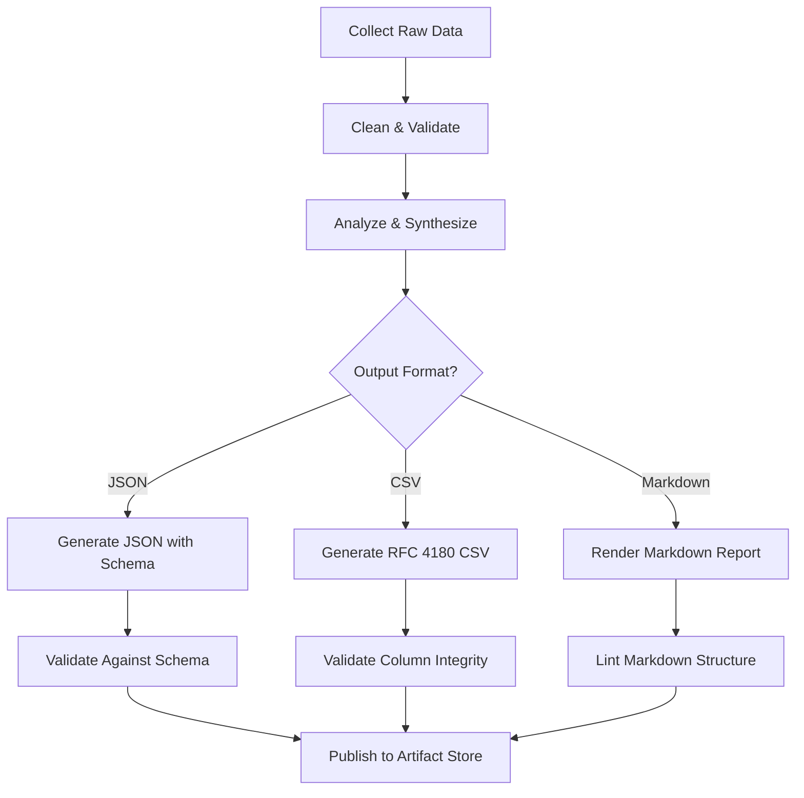
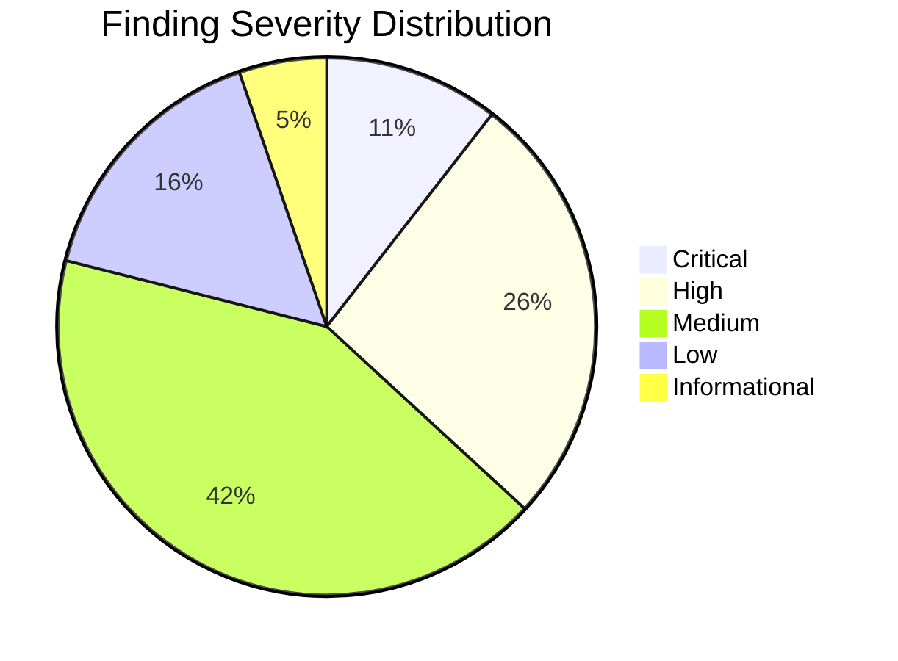
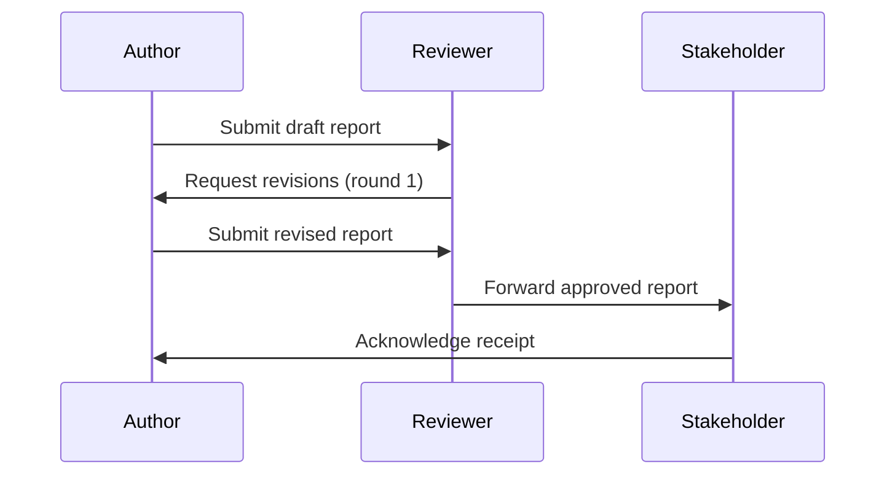

# Report Writing & Structured Output

Comprehensive guide to producing high-quality research reports and structured output. Covers report architecture, formatting standards, structured data output (JSON, CSV), visualization embedding, executive summary crafting, citation management, multi-format generation pipelines, reusable templates, and automated report generation workflows.

## Table of Contents

1. Report Structure & Architecture
2. Markdown Formatting Standards
3. JSON Output Structuring
4. CSV & Tabular Output
5. Data Visualization in Reports
6. Executive Summary Writing
7. Citation & Source Attribution
8. Multi-format Output Generation
9. Report Templates
10. Automated Report Generation
11. Quality Assurance & Validation
12. Best Practices
13. Anti-Patterns
14. Sources & References

---

## 1. Report Structure & Architecture

### The Inverted Pyramid

Research reports follow the inverted pyramid model: the most critical information appears first, with supporting detail expanding below. Readers at any level of engagement should come away with the right takeaway.

**Core Document Architecture**:

| Section | Purpose | Size (% of doc) |
|:--------|:--------|:----------------:|
| Executive Summary | Standalone overview of findings and recommendations | 5-10% |
| Introduction / Background | Context, scope, objectives | 5-8% |
| Methodology | How the research was conducted | 10-15% |
| Findings | Raw results organized by theme or question | 30-40% |
| Analysis & Discussion | Interpretation, comparisons, implications | 15-20% |
| Recommendations | Actionable next steps tied to findings | 10-15% |
| Conclusion | Synthesis and forward look | 3-5% |
| Appendices | Supporting data, raw tables, supplementary material | Variable |

### Writing Order vs. Reading Order

The optimal writing order differs from the final reading order. Write in this sequence:

1. **Methodology** — Document while conducting research so nothing is lost.
2. **Findings** — Record results as they emerge, before interpretation bias sets in.
3. **Analysis & Discussion** — Interpret findings with full context.
4. **Recommendations** — Derive directly from analysis; every recommendation must link to a finding.
5. **Introduction** — Frame the report now that you know what it contains.
6. **Conclusion** — Synthesize; do not introduce new information here.
7. **Executive Summary** — Write last, place first. It must stand alone.

### Section Dependency Chain

Every section should reference its logical predecessors:

```
Methodology --> Findings --> Analysis --> Recommendations
     |              |            |              |
     v              v            v              v
  "How we did it"  "What we found"  "What it means"  "What to do"
```

Each finding must trace back to a methodology step. Each recommendation must trace back to a finding. This traceability is the backbone of credible reporting.

### Heading Hierarchy Rules

- **H1** (`#`): Document title only. One per document.
- **H2** (`##`): Major sections (Methodology, Findings, etc.).
- **H3** (`###`): Subsections within a major section.
- **H4** (`####`): Detailed breakdowns within subsections.
- Never skip heading levels (e.g., do not jump from H2 to H4).
- Headings should be descriptive and scannable. Prefer "API Response Time Degraded Under Load" over "Finding 3".

---

## 2. Markdown Formatting Standards

### Document Structure Conventions

Use consistent Markdown that renders correctly across GitHub, GitLab, Pandoc, and common static site generators.

**Frontmatter metadata** (YAML):

```yaml
---
title: "Q4 2025 Infrastructure Audit Report"
authors:
  - name: "Alex Chen"
    role: "Lead Researcher"
  - name: "Jordan Blake"
    role: "Security Analyst"
date: 2025-12-15
version: "1.2.0"
status: "Final"
classification: "Internal"
tags:
  - infrastructure
  - security
  - audit
---
```

### GitHub-Flavored Markdown Callouts

GitHub supports alert syntax for drawing attention to critical information:

```markdown
> [!NOTE]
> This finding applies only to the production environment.

> [!TIP]
> Use connection pooling to reduce the overhead identified in Finding 3.

> [!WARNING]
> The current authentication mechanism will reach end-of-life in Q2 2026.
> Migration must begin no later than March 2026.

> [!CAUTION]
> Do not apply these recommendations to the legacy system without
> first completing the dependency audit in Appendix C.

> [!IMPORTANT]
> All data referenced in this report was collected between
> 2025-10-01 and 2025-12-01.
```

### Tables with Alignment

Use column alignment to improve readability of numerical and categorical data:

```markdown
| Metric              |   Baseline |   Current |   Change |
|:--------------------|-----------:|----------:|---------:|
| P95 Latency (ms)    |        120 |       340 |   +183%  |
| Error Rate (%)      |       0.02 |      0.15 |   +650%  |
| Throughput (req/s)   |      1,200 |       890 |    -26%  |
| Uptime (%)          |      99.97 |     99.82 |   -0.15  |
```

Left-align text columns (`:---`), right-align numbers (`---:`), center labels (`:---:`).

### Reference-Style Links

For documents with many links, use reference-style to keep the prose readable:

```markdown
According to the [JSON Schema specification][json-schema], all structured
outputs should include a `$schema` property. The [Pandoc manual][pandoc]
documents over 40 supported output formats.

[json-schema]: https://json-schema.org/
[pandoc]: https://pandoc.org/MANUAL.html
```

### Lists and Nesting

- Use `-` for unordered lists (consistent across parsers).
- Use `1.` for ordered lists (auto-numbering).
- Nest with 2 or 4 spaces (be consistent within a document).
- Limit nesting to 3 levels. Deeper nesting signals a need for restructuring.

---

## 3. JSON Output Structuring

### Schema-First Design

Define a JSON Schema before producing any structured JSON output. This ensures consistency across report versions and enables automated validation.

**Research Report Schema Example**:

```json
{
  "$schema": "https://json-schema.org/draft/2020-12/schema",
  "title": "ResearchReport",
  "description": "Schema for structured research report output",
  "type": "object",
  "required": ["metadata", "executive_summary", "findings", "recommendations"],
  "additionalProperties": false,
  "properties": {
    "metadata": {
      "type": "object",
      "required": ["title", "authors", "date", "version", "status"],
      "additionalProperties": false,
      "properties": {
        "title": {
          "type": "string",
          "minLength": 1,
          "maxLength": 200
        },
        "authors": {
          "type": "array",
          "items": {
            "type": "object",
            "required": ["name"],
            "properties": {
              "name": { "type": "string" },
              "role": { "type": "string" },
              "email": { "type": "string", "format": "email" }
            },
            "additionalProperties": false
          },
          "minItems": 1
        },
        "date": {
          "type": "string",
          "format": "date"
        },
        "version": {
          "type": "string",
          "pattern": "^\\d+\\.\\d+\\.\\d+$"
        },
        "status": {
          "type": "string",
          "enum": ["Draft", "In Review", "Final", "Archived"]
        }
      }
    },
    "executive_summary": {
      "type": "string",
      "minLength": 50,
      "maxLength": 5000
    },
    "findings": {
      "type": "array",
      "items": {
        "type": "object",
        "required": ["id", "title", "severity", "description", "evidence"],
        "additionalProperties": false,
        "properties": {
          "id": {
            "type": "string",
            "pattern": "^F-\\d{3}$"
          },
          "title": { "type": "string" },
          "severity": {
            "type": "string",
            "enum": ["Critical", "High", "Medium", "Low", "Informational"]
          },
          "description": { "type": "string" },
          "evidence": {
            "type": "array",
            "items": { "type": "string" },
            "minItems": 1
          },
          "affected_systems": {
            "type": "array",
            "items": { "type": "string" }
          }
        }
      },
      "minItems": 1
    },
    "recommendations": {
      "type": "array",
      "items": {
        "type": "object",
        "required": ["id", "title", "priority", "related_findings", "description"],
        "additionalProperties": false,
        "properties": {
          "id": {
            "type": "string",
            "pattern": "^R-\\d{3}$"
          },
          "title": { "type": "string" },
          "priority": {
            "type": "string",
            "enum": ["Immediate", "Short-term", "Medium-term", "Long-term"]
          },
          "related_findings": {
            "type": "array",
            "items": {
              "type": "string",
              "pattern": "^F-\\d{3}$"
            },
            "minItems": 1
          },
          "description": { "type": "string" },
          "estimated_effort": { "type": "string" },
          "expected_impact": { "type": "string" }
        }
      }
    }
  }
}
```

### Key Schema Design Principles

- **`additionalProperties: false`** on every object to prevent schema drift and ensure strict validation.
- **`enum`** for controlled vocabularies (severity levels, status values, priority tiers).
- **`pattern`** for identifiers to enforce consistent ID formats (e.g., `F-001`, `R-001`).
- **`required`** fields declared explicitly at every level.
- **`format`** for dates (`date`), emails (`email`), and URIs (`uri`) to leverage built-in validation.

### Metadata Conventions

Every JSON output file must include a `metadata` block with at minimum:

- `title` — Human-readable report name
- `authors` — List of contributors with roles
- `date` — ISO 8601 date of generation
- `version` — Semantic version string
- `status` — Current document lifecycle stage

---

## 4. CSV & Tabular Output

### RFC 4180 Compliance

All CSV output must comply with RFC 4180:

- Fields containing commas, double quotes, or line breaks must be enclosed in double quotes.
- Double quotes within fields are escaped by doubling them (`""`).
- Each record occupies one line, terminated by CRLF (though LF is acceptable for Unix systems).
- The first line should be a header row.

### Data Formatting Standards

| Data Type | Format | Example |
|:----------|:-------|:--------|
| Dates | ISO 8601 | `2025-12-15` |
| Timestamps | ISO 8601 with timezone | `2025-12-15T14:30:00Z` |
| Decimals | Dot separator, no thousands | `1234.56` |
| Booleans | Lowercase | `true`, `false` |
| Null values | Empty field | `,,` |
| Currency | Numeric only (no symbols) | `1234.56` |
| Percentages | Decimal (0-1) or explicit (0-100) | `0.85` or `85` (document which) |

### Rules for Clean CSV

- **UTF-8 encoding** with no BOM (byte order mark) unless targeting Excel specifically.
- **No locale-specific formatting** — do not use `1.234,56` or `12/15/2025`.
- **Consistent column order** across report versions.
- **Include a header row** with descriptive, snake_case column names.
- **One entity per row** — do not merge cells or span rows.
- **Document units** in the header or a companion metadata file (e.g., `latency_ms` not `latency`).

### CSV Header Naming Conventions

```
finding_id,title,severity,date_identified,affected_system,description,evidence_count
F-001,API Timeout Under Load,High,2025-11-03,payment-service,"P95 latency exceeds SLA threshold",3
F-002,Stale Cache Invalidation,Medium,2025-11-10,catalog-service,"Cache TTL misalignment causes stale reads",2
```

Use `snake_case` for all headers. Avoid abbreviations unless universally understood. Include the unit in the column name when applicable (`response_time_ms`, `memory_usage_mb`).

---

## 5. Data Visualization in Reports

### Mermaid Diagrams

Mermaid renders natively in GitHub Markdown, GitLab, Notion, and many documentation platforms. Use it for process flows, architecture diagrams, and data relationships.

**Flowchart — Report Generation Pipeline**:



**Pie Chart — Finding Severity Distribution**:



**Sequence Diagram — Report Review Workflow**:



### ASCII Tables with tabulate

For environments where Mermaid is not available, use Python's `tabulate` library:

```python
from tabulate import tabulate

findings = [
    ["F-001", "API Timeout Under Load", "High", "payment-service"],
    ["F-002", "Stale Cache Invalidation", "Medium", "catalog-service"],
    ["F-003", "Unencrypted PII in Logs", "Critical", "auth-service"],
]

headers = ["ID", "Title", "Severity", "Affected System"]

print(tabulate(findings, headers=headers, tablefmt="github"))
```

Output:

```
| ID    | Title                     | Severity   | Affected System   |
|-------|---------------------------|------------|-------------------|
| F-001 | API Timeout Under Load    | High       | payment-service   |
| F-002 | Stale Cache Invalidation  | Medium     | catalog-service   |
| F-003 | Unencrypted PII in Logs   | Critical   | auth-service      |
```

### Chart Embedding Strategies

- **Static images**: Generate with matplotlib/seaborn, embed as ``.
- **Mermaid code blocks**: Inline in Markdown, rendered by platform.
- **Interactive charts**: Use Plotly for HTML reports; export as static PNG for PDF.
- **SVG preferred**: Vector graphics scale without quality loss and keep file sizes small.

---

## 6. Executive Summary Writing

### Purpose and Constraints

The executive summary is a self-contained briefing. A reader who reads nothing else should understand: what was studied, what was found, and what should be done.

**Constraints**:

- No longer than 10% of the full document length.
- Written last, placed first.
- Must stand completely alone — no forward references like "as discussed in Section 4".
- Every finding mentioned must map to a recommendation.
- Use concrete numbers, not vague qualifiers ("latency increased 183%" not "latency increased significantly").

### Structure of an Executive Summary

1. **Context** (1-2 sentences): Why this report exists, what was the scope.
2. **Key Findings** (3-5 bullets): The most important discoveries, ranked by impact.
3. **Recommendations** (3-5 bullets): Actionable next steps with priority and timeline.
4. **Risk Statement** (1 sentence): What happens if recommendations are not implemented.

### Example Executive Summary

> This report presents the findings of the Q4 2025 infrastructure audit covering
> the payment, catalog, and authentication services across production and staging
> environments.
>
> **Key Findings**:
> - P95 API latency for the payment service has increased 183% since Q3, from
>   120ms to 340ms, exceeding the 200ms SLA threshold.
> - Personally identifiable information (PII) is logged in plaintext by the
>   authentication service, creating a compliance risk under GDPR Article 32.
> - Cache invalidation in the catalog service uses a fixed 24-hour TTL, causing
>   stale product data for 12% of user sessions.
>
> **Recommendations**:
> - **Immediate**: Implement log redaction for PII fields in the auth service
>   (estimated effort: 3 engineering days).
> - **Short-term**: Introduce connection pooling and query optimization for the
>   payment service (estimated effort: 2 sprints).
> - **Medium-term**: Replace fixed TTL with event-driven cache invalidation in
>   the catalog service (estimated effort: 1 quarter).
>
> Failure to address the PII logging issue exposes the organization to regulatory
> penalties of up to 4% of annual revenue under GDPR.

### Checklist

- [ ] Written after the rest of the report is complete
- [ ] Under 10% of total document length
- [ ] Contains no forward references to later sections
- [ ] All findings cite specific data points
- [ ] All recommendations include estimated effort and priority
- [ ] Risk statement quantifies consequences of inaction

---

## 7. Citation & Source Attribution

### Citation Styles by Report Type

| Report Type | Recommended Style | Inline Format |
|:------------|:------------------|:--------------|
| Technical audit | IEEE | [1], [2] |
| Academic research | APA 7th | (Author, Year) |
| Business / consulting | Chicago (notes) | Footnotes |
| Internal engineering | Numbered references | [1], [2] |

### IEEE Numbered References (Technical Reports)

For technical reports, use bracketed numbers in the text and a numbered reference list at the end:

**In text**:

> The JSON Schema specification [1] defines a vocabulary for annotating and
> validating JSON documents. Prior research on report automation [2] demonstrates
> a 60% reduction in manual effort when using template-driven generation.

**Reference list**:

> [1] JSON Schema, "JSON Schema: A Media Type for Describing JSON Documents,"
> json-schema.org. [Online]. Available: https://json-schema.org/
>
> [2] A. Chen and J. Blake, "Automated Report Generation in CI/CD Pipelines,"
> in Proc. DevOps Conf., 2025, pp. 112-118.

### Markdown Citation Patterns

For Markdown documents, combine reference-style links with a dedicated References section:

```markdown
According to the Pandoc documentation [1], single-source authoring enables
conversion to over 40 output formats from a single Markdown source.

## References

1. [Pandoc User's Guide](https://pandoc.org/MANUAL.html)
2. [Mermaid Documentation](https://mermaid.js.org/)
3. [JSON Schema Specification](https://json-schema.org/)
4. [GitHub Advanced Formatting](https://docs.github.com/en/get-started/writing-on-github/working-with-advanced-formatting/creating-diagrams)
```

### Attribution Rules

- Cite the source of every statistic, benchmark, and external claim.
- When paraphrasing, still cite the source.
- For data tables derived from external sources, note the source in a table caption or footnote.
- For internal data (e.g., production metrics), cite the monitoring system and date range.
- Version-pin references where possible (link to a specific version of documentation, not just the root URL).

---

## 8. Multi-format Output Generation

### Single-Source Authoring

Write once in Markdown, convert to any target format. This is the most maintainable approach for reports that must be delivered in multiple formats (PDF for stakeholders, HTML for intranet, JSON for dashboards).

### Pandoc Conversion Pipeline

Pandoc supports 40+ input and output formats. Common report conversions:

```bash
# Markdown to PDF (via LaTeX)
pandoc report.md -o report.pdf \
  --pdf-engine=xelatex \
  --metadata-file=metadata.yaml \
  --table-of-contents \
  --number-sections

# Markdown to HTML with embedded styles
pandoc report.md -o report.html \
  --standalone \
  --css=report-style.css \
  --table-of-contents \
  --metadata title="Q4 Infrastructure Audit"

# Markdown to DOCX for stakeholders who require Word
pandoc report.md -o report.docx \
  --reference-doc=template.docx \
  --table-of-contents

# Markdown to JSON (structured AST)
pandoc report.md -t json -o report-ast.json
```

### Node.js Conversion Utilities

For programmatic conversion within JavaScript/TypeScript pipelines:

```javascript
import { stringify } from "csv-stringify/sync";
import json2md from "json2md";

// JSON findings to Markdown
function findingsToMarkdown(findings) {
  const mdContent = json2md([
    { h2: "Findings" },
    ...findings.map((f) => [
      { h3: `${f.id}: ${f.title}` },
      { p: `**Severity**: ${f.severity}` },
      { p: f.description },
      {
        ul: f.evidence.map((e) => e),
      },
    ]).flat(),
  ]);
  return mdContent;
}

// Findings to CSV
function findingsToCSV(findings) {
  const records = findings.map((f) => ({
    finding_id: f.id,
    title: f.title,
    severity: f.severity,
    description: f.description,
    evidence_count: f.evidence.length,
    affected_systems: f.affected_systems?.join("; ") || "",
  }));

  return stringify(records, {
    header: true,
    columns: [
      "finding_id",
      "title",
      "severity",
      "description",
      "evidence_count",
      "affected_systems",
    ],
  });
}
```

### Format Selection Guide

| Audience | Primary Format | Secondary Format | Notes |
|:---------|:---------------|:-----------------|:------|
| Engineering team | Markdown | JSON | Version-controlled, machine-readable |
| Executive leadership | PDF | PPTX | Polished, printable |
| External stakeholders | PDF | DOCX | Formal, editable on request |
| Dashboard / automation | JSON | CSV | API-consumable |
| Internal wiki | HTML | Markdown | Searchable, linkable |

---

## 9. Report Templates

### Research Report Template

```markdown
---
title: "[Report Title]"
authors:
  - name: "[Author Name]"
    role: "[Role]"
date: YYYY-MM-DD
version: "0.1.0"
status: "Draft"
type: "[Market Research | Technical Audit | UX Research | Feasibility Study]"
---

# [Report Title]

## Executive Summary

[Written last. 5-10% of document. Must stand alone.]

## 1. Introduction

### 1.1 Background
[Context and motivation for this research.]

### 1.2 Objectives
[Specific questions this report answers.]

### 1.3 Scope
[What is included and explicitly excluded.]

## 2. Methodology

### 2.1 Research Approach
[Qualitative, quantitative, mixed methods.]

### 2.2 Data Sources
[Systems, APIs, surveys, interviews, documents.]

### 2.3 Analysis Methods
[Statistical methods, frameworks, tools used.]

### 2.4 Limitations
[Known constraints, biases, gaps.]

## 3. Findings

### 3.1 [Finding Theme 1]
**Finding F-001**: [Title]
- **Severity**: [Critical | High | Medium | Low | Informational]
- **Description**: [What was observed]
- **Evidence**: [Data points, screenshots, logs]
- **Affected Systems**: [List]

### 3.2 [Finding Theme 2]
[Repeat structure]

## 4. Analysis & Discussion

### 4.1 [Analysis Theme 1]
[Interpretation of findings, comparisons, implications]

### 4.2 Cross-Cutting Themes
[Patterns that span multiple findings]

## 5. Recommendations

### 5.1 Immediate Actions
| ID | Recommendation | Related Findings | Effort | Impact |
|:---|:---------------|:-----------------|:-------|:-------|
| R-001 | [Action] | F-001 | [Estimate] | [Expected outcome] |

### 5.2 Short-term Actions (1-3 months)
[Table format]

### 5.3 Medium-term Actions (3-6 months)
[Table format]

## 6. Conclusion

[Synthesis of findings and recommendations. No new information.]

## Appendices

### Appendix A: Raw Data
### Appendix B: Methodology Details
### Appendix C: Glossary

## References

1. [Source 1](URL)
2. [Source 2](URL)
```

### Report Type Variations

**Market Research** — Emphasize competitive landscape, market sizing, customer segments. Include SWOT analysis. Recommendations focus on go-to-market strategy.

**Technical Audit** — Emphasize system architecture, performance metrics, security posture. Include severity ratings. Recommendations focus on remediation with effort estimates.

**UX Research** — Emphasize user personas, task flows, usability metrics. Include journey maps and heuristic evaluations. Recommendations focus on design changes.

**Feasibility Study** — Emphasize technical feasibility, financial viability, risk assessment. Include cost-benefit analysis. Recommendations focus on go/no-go decision with criteria.

---

## 10. Automated Report Generation

### Python: Jinja2 + WeasyPrint Pipeline

```python
import json
from datetime import datetime
from pathlib import Path

from jinja2 import Environment, FileSystemLoader
from weasyprint import HTML


def generate_report(data_path: str, template_path: str, output_dir: str) -> dict:
    """
    Generate a research report in multiple formats from structured JSON data.

    Args:
        data_path: Path to the JSON data file (validated against schema).
        template_path: Path to the Jinja2 template directory.
        output_dir: Directory for generated output files.

    Returns:
        Dictionary with paths to generated files.
    """
    # Load and parse data
    with open(data_path, "r", encoding="utf-8") as f:
        report_data = json.load(f)

    # Set up Jinja2 environment
    env = Environment(
        loader=FileSystemLoader(template_path),
        autoescape=False,
        trim_blocks=True,
        lstrip_blocks=True,
    )

    # Generate Markdown
    md_template = env.get_template("report.md.j2")
    md_content = md_template.render(
        report=report_data,
        generated_at=datetime.utcnow().isoformat() + "Z",
    )

    output_path = Path(output_dir)
    output_path.mkdir(parents=True, exist_ok=True)

    md_file = output_path / "report.md"
    md_file.write_text(md_content, encoding="utf-8")

    # Generate HTML from Markdown template
    html_template = env.get_template("report.html.j2")
    html_content = html_template.render(
        report=report_data,
        generated_at=datetime.utcnow().isoformat() + "Z",
    )

    html_file = output_path / "report.html"
    html_file.write_text(html_content, encoding="utf-8")

    # Generate PDF from HTML
    pdf_file = output_path / "report.pdf"
    HTML(string=html_content).write_pdf(str(pdf_file))

    # Generate JSON output (validated structured data)
    json_file = output_path / "report.json"
    json_file.write_text(
        json.dumps(report_data, indent=2, ensure_ascii=False),
        encoding="utf-8",
    )

    # Generate CSV for findings
    csv_file = output_path / "findings.csv"
    _write_findings_csv(report_data.get("findings", []), csv_file)

    return {
        "markdown": str(md_file),
        "html": str(html_file),
        "pdf": str(pdf_file),
        "json": str(json_file),
        "csv": str(csv_file),
    }


def _write_findings_csv(findings: list, output_path: Path) -> None:
    """Write findings to CSV in RFC 4180 format."""
    import csv

    headers = [
        "finding_id",
        "title",
        "severity",
        "description",
        "evidence_count",
        "affected_systems",
    ]

    with open(output_path, "w", newline="", encoding="utf-8") as f:
        writer = csv.DictWriter(f, fieldnames=headers, quoting=csv.QUOTE_ALL)
        writer.writeheader()
        for finding in findings:
            writer.writerow({
                "finding_id": finding["id"],
                "title": finding["title"],
                "severity": finding["severity"],
                "description": finding["description"],
                "evidence_count": len(finding.get("evidence", [])),
                "affected_systems": "; ".join(finding.get("affected_systems", [])),
            })


if __name__ == "__main__":
    result = generate_report(
        data_path="data/report-data.json",
        template_path="templates/",
        output_dir="output/",
    )
    print("Generated files:")
    for fmt, path in result.items():
        print(f"  {fmt}: {path}")
```

### Jinja2 Markdown Template (report.md.j2)

```jinja2
---
title: "{{ report.metadata.title }}"
date: {{ report.metadata.date }}
version: {{ report.metadata.version }}
status: {{ report.metadata.status }}
generated_at: {{ generated_at }}
---

# {{ report.metadata.title }}

## Executive Summary

{{ report.executive_summary }}

## Findings


### {{ finding.id }}: {{ finding.title }}

- **Severity**: {{ finding.severity }}
- **Description**: {{ finding.description }}

- **Affected Systems**: {{ finding.affected_systems | join(", ") }}


**Evidence**:

{{ loop.index }}. {{ item }}




## Recommendations

| ID | Recommendation | Priority | Related Findings | Effort |
|:---|:---------------|:---------|:-----------------|:-------|

| {{ rec.id }} | {{ rec.title }} | {{ rec.priority }} | {{ rec.related_findings | join(", ") }} | {{ rec.estimated_effort | default("TBD") }} |


---

*Generated on {{ generated_at }} | Version {{ report.metadata.version }}*
```

### CI Pipeline Integration

Automate report generation in CI/CD pipelines for recurring reports (weekly metrics, sprint retrospectives, deployment audits):

```yaml
# .github/workflows/generate-report.yml
name: Generate Weekly Report

on:
  schedule:
    - cron: "0 9 * * 1"  # Every Monday at 9:00 UTC
  workflow_dispatch:

jobs:
  generate:
    runs-on: ubuntu-latest
    steps:
      - uses: actions/checkout@v4

      - name: Set up Python
        uses: actions/setup-python@v5
        with:
          python-version: "3.12"

      - name: Install dependencies
        run: pip install jinja2 weasyprint jsonschema

      - name: Collect metrics data
        run: python scripts/collect_metrics.py --output data/weekly-data.json

      - name: Validate data against schema
        run: python scripts/validate_schema.py data/weekly-data.json schemas/report.schema.json

      - name: Generate report
        run: python scripts/generate_report.py data/weekly-data.json --output output/

      - name: Upload artifacts
        uses: actions/upload-artifact@v4
        with:
          name: weekly-report-${{ github.run_number }}
          path: output/
```

---

## 11. Quality Assurance & Validation

### Schema Validation

Validate all JSON output against its schema before publishing:

```python
import json
import jsonschema

def validate_report(report_path: str, schema_path: str) -> list[str]:
    """Validate a report JSON file against its schema. Returns list of errors."""
    with open(report_path) as f:
        report = json.load(f)
    with open(schema_path) as f:
        schema = json.load(f)

    validator = jsonschema.Draft202012Validator(schema)
    errors = sorted(validator.iter_errors(report), key=lambda e: list(e.path))

    return [
        f"  Path: {'.'.join(str(p) for p in error.path)}\n  Error: {error.message}"
        for error in errors
    ]
```

### Markdown Linting

Use markdownlint to enforce consistent formatting:

```json
{
  "MD001": true,
  "MD003": { "style": "atx" },
  "MD004": { "style": "dash" },
  "MD013": { "line_length": 100, "tables": false },
  "MD024": { "siblings_only": true },
  "MD033": false,
  "MD041": true
}
```

### Traceability Audit

Every report should pass a traceability check:

- Every finding has at least one piece of evidence.
- Every recommendation links to at least one finding.
- Every finding referenced in recommendations actually exists.
- No orphaned findings (findings not addressed by any recommendation).
- No orphaned recommendations (recommendations not supported by any finding).

### Review Checklist

- [ ] Heading hierarchy is consistent (no skipped levels)
- [ ] Executive summary is under 10% of total length
- [ ] All data claims cite sources
- [ ] All findings have severity ratings
- [ ] All recommendations have priority and effort estimates
- [ ] No new information in the conclusion
- [ ] JSON output validates against schema
- [ ] CSV output is RFC 4180 compliant
- [ ] All links resolve (no 404s)
- [ ] Metadata is complete and accurate
- [ ] Version number has been incremented

---

## 12. Best Practices

### Report Authoring

- **Write the executive summary last, place it first.** It must reflect the entire document accurately.
- **One idea per paragraph, one theme per section.** If a section addresses multiple themes, split it.
- **Every finding links to evidence, every recommendation links to a finding.** Traceability is non-negotiable.
- **Use the inverted pyramid.** Most important information first at every level (document, section, paragraph).
- **Be specific.** "Latency increased 183% from 120ms to 340ms" is better than "latency increased significantly."

### Structured Output

- **Store data in the most structured format (JSON/CSV), present in the most readable (Markdown/PDF).** Generate readable formats from structured sources, not the other way around.
- **Use JSON Schema validation for all structured outputs.** Never rely on manual inspection.
- **Include metadata in every output file.** Title, authors, date, version, and status at minimum.
- **Use controlled vocabularies via `enum` in schemas.** Prevent inconsistency in categorical fields.
- **Enforce `additionalProperties: false`.** Prevents undocumented fields from creeping into output over time.

### Process & Workflow

- **Automate report generation with CI pipelines.** Recurring reports should never be manually assembled.
- **Version control reports alongside code.** Reports are artifacts; treat them with the same rigor.
- **Single-source authoring.** Write in Markdown, convert to all other formats programmatically.
- **Validate before publishing.** Schema validation for JSON, RFC 4180 compliance for CSV, markdownlint for Markdown.
- **Template recurring reports.** Create Jinja2 or Mustache templates with placeholders for data; swap in new data each cycle.

---

## 13. Anti-Patterns

### Report Structure Anti-Patterns

- **Wall of text without structure.** Long prose without headings, bullets, or tables. Readers cannot scan or navigate. Always impose structure with headings, lists, and visual hierarchy.
- **Conclusion smuggling.** Introducing new findings or data in the conclusion section. The conclusion must only synthesize what was already presented. New information belongs in Findings.
- **Recommendation without evidence.** Suggesting an action that is not supported by any finding in the report. Every recommendation must trace back to at least one documented finding.
- **Orphaned findings.** Documenting a problem but never addressing it in the recommendations. Every finding should either be addressed or explicitly noted as out of scope.
- **Vague quantification.** Using "significant increase" or "many users" instead of specific numbers. Always quantify with exact figures, percentages, and date ranges.

### Structured Output Anti-Patterns

- **Schema drift between report versions.** Changing the JSON structure without updating the schema or incrementing the version. Consumers of the data break silently.
- **Validating by eyeball instead of schema validation.** Manually reviewing JSON or CSV output for correctness instead of running automated validation. Errors will be missed at scale.
- **Monolithic output.** Producing only a single format (e.g., only PDF). Different audiences need different formats. Generate from a structured source to multiple targets.
- **Locale-specific formatting in data files.** Using `1.234,56` for numbers or `12/15/2025` for dates in CSV. Always use ISO 8601 for dates and dot-separated decimals.
- **Embedding data in presentation format only.** Putting numbers only in a chart image with no underlying data file. The data becomes inaccessible for reuse or validation.

### Process Anti-Patterns

- **Manual copy-paste reports.** Assembling reports by copying data from dashboards into documents by hand. This is error-prone and does not scale. Automate the pipeline.
- **No version control.** Emailing report drafts back and forth or saving "report_final_v2_FINAL.docx" to shared drives. Use git for version history and collaboration.
- **No review process.** Publishing reports without peer review. Even automated reports need periodic review of the templates and data pipelines.
- **Inconsistent metadata.** Omitting dates, authors, or version numbers. Every report artifact must be traceable to its creation context.

---

## 14. Sources & References

1. [Pandoc User's Guide](https://pandoc.org/MANUAL.html) — Comprehensive documentation for the universal document converter supporting 40+ input and output formats.
2. [Mermaid Documentation](https://mermaid.js.org/) — Diagramming and charting tool that renders from text definitions in Markdown.
3. [JSON Schema Specification](https://json-schema.org/) — The vocabulary for annotating and validating JSON documents, including draft 2020-12.
4. [Effective Research Communication in Health Sciences (PMC)](https://pmc.ncbi.nlm.nih.gov/articles/PMC11616281/) — Peer-reviewed article on structuring research reports for clarity and impact.
5. [GitHub: Creating Diagrams](https://docs.github.com/en/get-started/writing-on-github/working-with-advanced-formatting/creating-diagrams) — GitHub documentation on embedding Mermaid diagrams in Markdown files.
6. [Asana: Executive Summary Examples](https://asana.com/resources/executive-summary-examples) — Practical guide and templates for writing effective executive summaries.
7. [RFC 4180: Common Format and MIME Type for CSV Files](https://datatracker.ietf.org/doc/html/rfc4180) — The IETF standard defining the CSV format.
8. [APA Style 7th Edition](https://apastyle.apa.org/) — Citation and formatting guidelines for academic and professional writing.
9. [WeasyPrint Documentation](https://doc.courtbouillon.org/weasyprint/stable/) — CSS-based PDF rendering engine for Python-driven report generation.
10. [Jinja2 Template Designer Documentation](https://jinja.palletsprojects.com/en/3.1.x/templates/) — Templating engine documentation for automated content generation.
